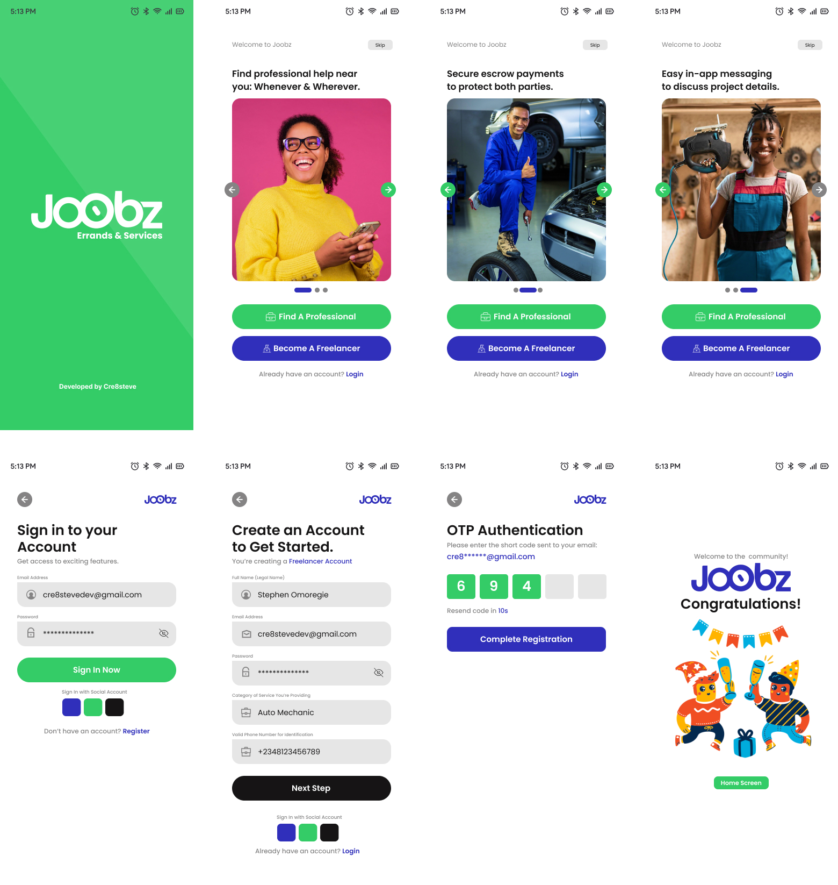

# Joobz - Connecting You with Local Professionals

Joobz is an innovative platform designed to seamlessly connect users with vetted, high-quality professionals and artisans for a wide range of services and errands. Our mission is to revolutionize how people find help, ensuring a smooth, reliable, and secure experience for both service seekers and providers.

## Key Features

- Dual Registration: Users can join as service seekers or freelancers, fostering a dynamic community of both clients and professionals.
- Verified Professionals: All service providers undergo a thorough vetting process, ensuring quality and trustworthiness.
- Secure Transactions: Our platform facilitates safe, transparent financial exchanges between users and freelancers by using an escrow system.
- Wide Service Range: From home repairs, car repairs, skilled services to personal errands, Joobz covers a diverse array of service categories.
- User-Friendly Interface: Intuitive design makes it easy to post jobs, find professionals, and manage bookings.
- Real-Time Communication: In-app messaging allows for clear, direct communication between clients and service providers.

## My Vision

Joobz aims to empower local communities by creating opportunities for skilled professionals while providing convenient, reliable solutions for everyday tasks and specialized services. I am committed to building a platform that values quality, fairness, and user satisfaction above all.

## Project Background

This project represents the culmination of a year-long Software Engineering Bootcamp with ALX Africa. It serves as a practical application of the full-stack development skills acquired during the program, showcasing proficiency in both frontend and backend technologies.

## Repository Contents

This repository contains the codebase for the backend implementation of Joobz, demonstrating expertise in modern development practices and backend development.

I invite you to explore Joobz and experience the future of service networking – where quality meets convenience, and every task finds its perfect match.

## AUTHOR

- Stephen Omoregie
- <cre8stevedev@gmail.com>
- <https://cre8stevedev.me>
- <https://linkedin.com/stephen-omoregie>
- Twitter: @Cre8steveDev

## Technology

- Node/ExpressJS
- Typescript
- MongoDB

## Productivity Tools

- React Native and Expo Code Snippets (VSCode Extension by Cre8steve)
- Visual Studio Code
- Claude AI for debugging and documentation research
